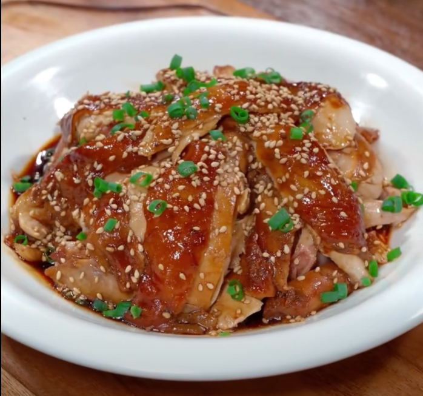

# Gà

## Đùi Gà Sốt Vừng

<figure markdown="span">
    
    <figcaption>Gà Xốt Vừng</figcaption>
</figure>

Nguyên liệu: Đùi gà, gừng, hành lá

Gia vị: Xì dầu, tương đen, dầu hào, đường nâu

1. Trụng thịt gà qua nước sôi
1. Ướp thịt gà trụng với __gừng__ và __tỏi__
1. Thêm __2 thìa xì dầu__,  __1/2 thìa tương đen__, __1 thìa dầu hào__, __1 thìa đường nâu__
1. Bóp trộn cho thấm gia vị, để nghỉ trong 20 phút
1. Để __gừng__ và __hành lá__ dưới đáy nồi cơm điện
1. Cho thịt gà vào, rưới nước sốt còn lại lên
1. Đổ lại phần nước ướp vào, đậy nắp
1. Nấu xong lại lấy thịt ra, xé thịt gà ra để ra đĩa, rưới lại nước sốt lên.
1. Rắc hạt __mè trắng__ với __hành lá cắt nhỏ__ lên trên.