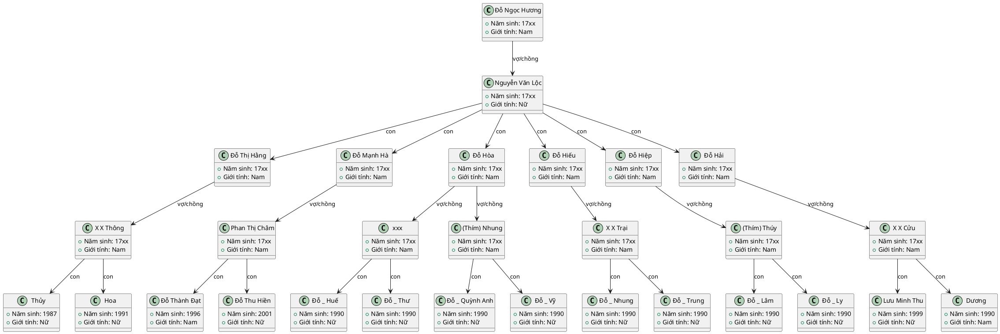

# Họ Nội

```puml
@startuml
skinparam backgroundcolor transparent
!define MARRIAGE(x, y) x --> y : "vợ/chồng"
!define CHILDREN(parents, kids) parents --> kids : "con"

class "Đỗ Ngọc Hương" as a0 {
    +Năm sinh: 17xx
    +Giới tính: Nam
}

class "Nguyễn Văn Lộc" as a1 {
    +Năm sinh: 17xx
    +Giới tính: Nữ
}

class "Đỗ Thị Hằng" as b0 {
    +Năm sinh: 17xx
    +Giới tính: Nam
}

class "Đỗ Mạnh Hà" as b1 {
    +Năm sinh: 17xx
    +Giới tính: Nam
}

class "Đỗ Hòa" as b2 {
    +Năm sinh: 17xx
    +Giới tính: Nam
}

class "Đỗ Hiếu" as b3 {
    +Năm sinh: 17xx
    +Giới tính: Nam
}

class "Đỗ Hiệp" as b4 {
    +Năm sinh: 17xx
    +Giới tính: Nam
}

class "Đỗ Hải" as b5 {
    +Năm sinh: 17xx
    +Giới tính: Nam
}

MARRIAGE(a0, a1)
CHILDREN(a1, b0)
CHILDREN(a1, b1)
CHILDREN(a1, b2)
CHILDREN(a1, b3)
CHILDREN(a1, b4)
CHILDREN(a1, b5)

class "X X Thông" as _b0 {
    +Năm sinh: 17xx
    +Giới tính: Nam
}

class "Phan Thị Châm" as _b1 {
    +Năm sinh: 17xx
    +Giới tính: Nam
}

class "xxx" as _b2 {
    +Năm sinh: 17xx
    +Giới tính: Nam
}

class "(Thím) Nhung" as __b2 {
    +Năm sinh: 17xx
    +Giới tính: Nam
}

class "X X Trại" as _b3 {
    +Năm sinh: 17xx
    +Giới tính: Nam
}

class "(Thím) Thúy" as _b4 {
    +Năm sinh: 17xx
    +Giới tính: Nam
}

class "X X Cửu" as _b5 {
    +Năm sinh: 17xx
    +Giới tính: Nam
}

MARRIAGE(b0, _b0)
MARRIAGE(b1, _b1)
MARRIAGE(b2, _b2)
MARRIAGE(b2, __b2)
MARRIAGE(b3, _b3)
MARRIAGE(b4, _b4)
MARRIAGE(b5, _b5)

class "Thủy" as c0 {
    +Năm sinh: 1987
    +Giới tính: Nữ
}

class "Hoa" as c1 {
    +Năm sinh: 1991
    +Giới tính: Nữ
}

class "Đỗ Thành Đạt" as c2 {
    +Năm sinh: 1996
    +Giới tính: Nam
}

class "Đỗ Thu Hiền" as c3 {
    +Năm sinh: 2001
    +Giới tính: Nữ
}

class "Đỗ _ Huế" as c4 {
    +Năm sinh: 1990
    +Giới tính: Nữ
}

class "Đỗ _ Thư" as c5 {
    +Năm sinh: 1990
    +Giới tính: Nữ
}

class "Đỗ _ Quỳnh Anh" as c6 {
    +Năm sinh: 1990
    +Giới tính: Nữ
}

class "Đỗ _ Vỹ" as c7 {
    +Năm sinh: 1990
    +Giới tính: Nữ
}

class "Đỗ _ Nhung" as c8 {
    +Năm sinh: 1990
    +Giới tính: Nữ
}

class "Đỗ _ Trung" as c9 {
    +Năm sinh: 1990
    +Giới tính: Nữ
}

class "Đỗ _ Lâm" as c10 {
    +Năm sinh: 1990
    +Giới tính: Nữ
}

class "Đỗ _ Ly" as c11 {
    +Năm sinh: 1990
    +Giới tính: Nữ
}

class "Lưu Minh Thu" as c12 {
    +Năm sinh: 1999
    +Giới tính: Nữ
}

class "Dương" as c13 {
    +Năm sinh: 1990
    +Giới tính: Nam
}

CHILDREN(_b0, c0)
CHILDREN(_b0, c1)
CHILDREN(_b1, c2)
CHILDREN(_b1, c3)
CHILDREN(_b2, c4)
CHILDREN(_b2, c5)
CHILDREN(__b2, c6)
CHILDREN(__b2, c7)
CHILDREN(_b3, c8)
CHILDREN(_b3, c9)
CHILDREN(_b4, c10)
CHILDREN(_b4, c11)
CHILDREN(_b5, c12)
CHILDREN(_b5, c13)

@enduml
```