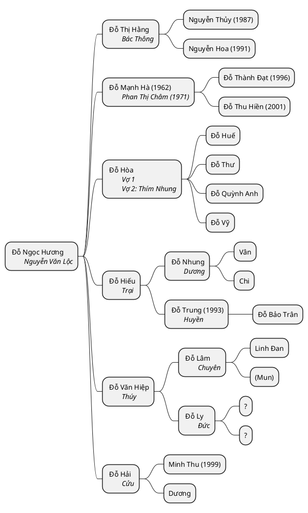
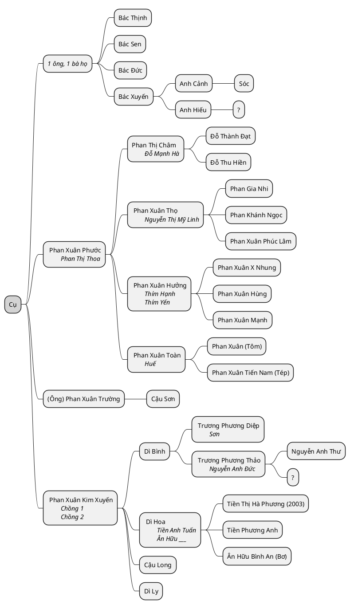

# Họ

## Nội

```puml
@startmindmap
skinparam backgroundcolor transparent

*: Đỗ Ngọc Hương
	//Nguyễn Văn Lộc//;

**: Đỗ Thị Hằng
	//Bác Thông//;
*** Nguyễn Thủy (1987)
*** Nguyễn Hoa (1991)

**: Đỗ Mạnh Hà (1962)
	//Phan Thị Châm (1971)//;
*** Đỗ Thành Đạt (1996)
*** Đỗ Thu Hiền (2001)

**: Đỗ Hòa
	//Vợ 1//
	//Vợ 2: Thím Nhung//;
*** Đỗ Huế
*** Đỗ Thư
*** Đỗ Quỳnh Anh
*** Đỗ Vỹ

**: Đỗ Hiếu
	//Trại//;
***: Đỗ Nhung
	//Dương//;
**** Vân
**** Chi
***: Đỗ Trung (1993)
	//Huyền//;
**** Đỗ Bảo Trân

**: Đỗ Văn Hiệp
	//Thúy//;
***: Đỗ Lâm
	//Chuyên//;
**** Linh Đan
**** (Mun)
***: Đỗ Ly
	//Đức//;
**** ?
**** ?

**: Đỗ Hải
	//Cửu//;
*** Minh Thu (1999)
*** Dương

@endmindmap
```
## Ngoại

```puml
@startmindmap
skinparam backgroundcolor transparent

*[#lightgray] Cụ

'Chi trên'
** //1 ông, 1 bà họ//
*** Bác Thịnh
*** Bác Sen
*** Bác Đức
*** Bác Xuyến
**** Anh Cảnh
***** Sóc
**** Anh Hiếu
***** ?

'Nhánh chính'
**: Phan Xuân Phước
	//Phan Thị Thoa//;
***:Phan Thị Châm
	//Đỗ Mạnh Hà//;
**** Đỗ Thành Đạt
**** Đỗ Thu Hiền

***: Phan Xuân Thọ
	//Nguyễn Thị Mỹ Linh//;
**** Phan Gia Nhi
**** Phan Khánh Ngọc
**** Phan Xuân Phúc Lâm

***: Phan Xuân Hưởng
	//Thím Hạnh//
	//Thím Yến//;
**** Phan Xuân X Nhung
**** Phan Xuân Hùng
**** Phan Xuân Mạnh

***: Phan Xuân Toàn
	//Huế//;
**** Phan Xuân (Tôm)
**** Phan Xuân Tiến Nam (Tép)

** (Ông) Phan Xuân Trường
*** Cậu Sơn

**: Phan Xuân Kim Xuyến
	//Chồng 1//
	//Chồng 2//;
*** Dì Bình
****: Trương Phương Diệp
	//Sơn//;
****: Trương Phương Thảo
	//Nguyễn Anh Đức//;
***** Nguyễn Anh Thư
***** ?

***: Dì Hoa
	//Tiền Anh Tuấn//
	//Ân Hữu ___//;
**** Tiền Thị Hà Phương (2003)
**** Tiền Phương Anh
**** Ân Hữu Bình An (Bơ)

*** Cậu Long
*** Dì Ly
@endmindmap
```