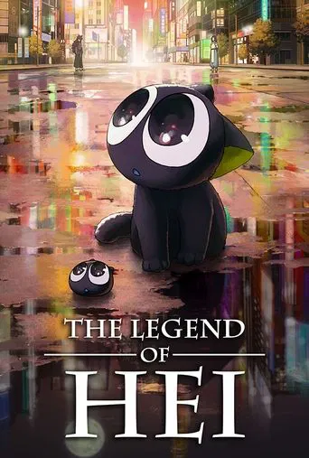
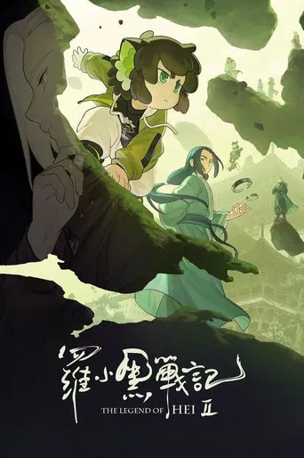

# \[Movie\] China

### Anh Đợi Em Ở Nơi Tận Cùng Của Thời Gian

{ .small-icon }

#### Anh Đợi Em Ở Nơi Tận Cùng Của Thời Gian

_Love You Forever (2020)_

Phim chưa xem không biết nội dung ra sao.

### Thanh Xà Bạch Xà

<!--  -->

{ .small-icon }

#### Bạch Xà I: Duyên Khởi (2019)

Phim khá hay, kể về chuyện hàng trăm năm trước 

<!--  -->

{ .small-icon }

#### Bạch xà 2: Thanh xà kiếp khởi (2021)

<!--  -->

{ .small-icon }

#### Bạch Xà 3: Phù Sinh (2024)

### Tiểu Yêu Quái Núi Lãng Lãng (2025)

{ .small-icon }

#### Tiểu Yêu Quái Núi Lãng Lãng (2025)

Gan to thật đấy! Một tiểu yêu vô danh cũng mơ thành Phật, sống mãi trường sinh. Chú heo nhỏ quyết định rời khỏi núi Lãng Lãng, cùng với yêu cóc, chồn tinh và quái vượn lập nên một đội “lấy kinh chốn dân gian”.

Trên hành trình Tây du, những tiểu yêu này sẽ phải đối mặt với những thử thách nào? Liệu cuộc phiêu lưu này là một giấc mộng hoang đường, hay là giấc mơ có thể trở thành hiện thực?

### The Legend of Hei

{ .small-icon }

#### The Legend of Hei

Cuộc phiêu lưu của bé mèo yêu tinh nhỏ sau khi cánh rừng bị con người phá hủy, chú phải phiêu lưu đến thế giới loài người để kiếm sống. Là một trong những yêu tinh chưa được xác định, bé mèo nhỏ bị một con người trên Vô Hạn bắt về Hội Quán yêu tinh. ...

{ .small-icon }

#### The Legend of Hei 2

Kể về phần sau bi kịch của phần trước, La Tiểu Hắc được Vô Hạn nhận nuôi và dạy dỗ trở thành đệ tử. Ở phần này cuộc sống không được quá yên bình thì cả hai bị kéo vào một âm mưu đen tối nhằm khơi dậy chiến tranh giữa loài người và yêu tinh. La Tiểu Hắc tham gia cùng với sư tỷ cùng nhau đi tìm kiếm hung thủ giải oan cho sư phụ.

