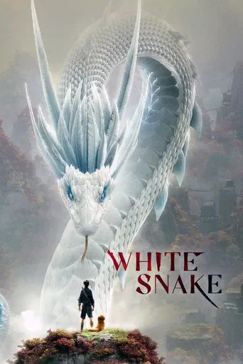
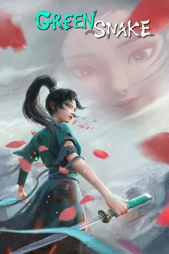
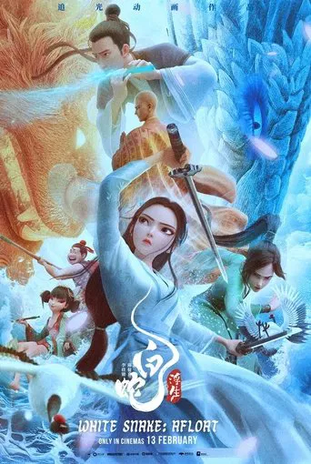
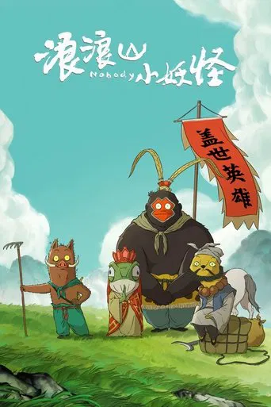

# \[Movie\] China

## Chưa Xem

{ .small-icon }

#### Anh Đợi Em Ở Nơi Tận Cùng Của Thời Gian
- _Love You Forever (2020)_

## Hoạt Hình 3D

{ .small-icon }

#### Bạch Xà: Duyên Khởi (2019)

_White Snake I_

{ .small-icon }

#### Bạch xà 2: Thanh xà kiếp khởi (2021)

_White Snake II: The Tribulation of the Green Snake_

{ .small-icon }

#### Bạch Xà 3: Phù Sinh (2024)

_White Snake: Afloat_

{ .small-icon }

#### Tiểu Yêu Quái Núi Lãng Lãng (2025)

Gan to thật đấy! Một tiểu yêu vô danh cũng mơ thành Phật, sống mãi trường sinh. Chú heo nhỏ quyết định rời khỏi núi Lãng Lãng, cùng với yêu cóc, chồn tinh và quái vượn lập nên một đội “lấy kinh chốn dân gian”.

Trên hành trình Tây du, những tiểu yêu này sẽ phải đối mặt với những thử thách nào? Liệu cuộc phiêu lưu này là một giấc mộng hoang đường, hay là giấc mơ có thể trở thành hiện thực?

