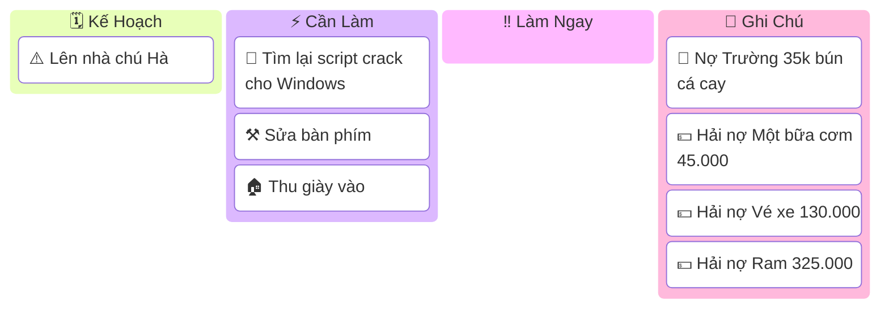

# Note



!!! abstract "Làm một bài về module `EditText` của __Android__"
    - Làm một bài về module `EditText` của __Android__
    - _Bài này được tách ra một phần trong lúc làm Engineering Mode_
    - Có một đoạn cần chú ý như này, dùng để thoát chế độ _focus_ vào `EditText` sau khi ấn ra ngoài khu vực làm việc _(không còn cái thanh điều hướng nằm trong hộp edittext)_

    ??? note "Tham khảo code mẫu này"
        ```java
        edtFreqChange.setOnEditorActionListener((v, actionId, event) -> {
            if (actionId == EditorInfo.IME_ACTION_DONE ||
                    (event != null && event.getKeyCode() == KeyEvent.KEYCODE_ENTER && event.getAction() == KeyEvent.ACTION_DOWN)) {

                // Set new text after Enter
                String str = edtFreqChange.getText().toString();
                int value = Integer.valueOf(str).intValue();
                if (value>20000) {
                    value = 20000;
                    edtFreqChange.setText(String.valueOf(value));
                }
                seekFrequenceChange.setProgress(value);

                // Exit edit mode by clearing focus and hiding keyboard
                edtFreqChange.clearFocus();
                InputMethodManager imm = (InputMethodManager)mApplicationContext.getSystemService(Context.INPUT_METHOD_SERVICE);
                imm.hideSoftInputFromWindow(edtFreqChange.getWindowToken(), 0);
                return true;
            }
            return false;
        });
        ```